# Insurance Claims Intelligence & Fraud Detection Platform

An enterprise-grade, end-to-end data engineering and MLOps platform for insurance claims analytics and automated fraud risk scoring. Designed to demonstrate production-inspired data architectures and machine learning lifecycle management for Data Science, ML Engineering, and Data Engineering

---

## 1. Project Overview

Auto insurance fraud costs the U.S. insurance industry over **$30 billion annually**, inflating premiums for everyday policyholders and straining Special Investigation Units (SIUs). 

This platform delivers an end-to-end solution:
1. **Cloud Data Ingestion & Transformation**: Automated pipeline from **AWS S3** into **Snowflake** utilizing Medallion architecture (`RAW` → `STAGING` → `ANALYTICS`).
2. **Automated Data Quality & Validation**: Data quality assertions and constraint auditing preventing bad data from entering the feature store.
3. **Reproducible ML Pipeline**: Self-contained scikit-learn preprocessing and estimator pipelines trained with stratified splits, class-weight balancing, and leak-free feature transforms.
4. **MLflow MLOps Lifecycle**: Complete experiment tracking, threshold optimization, and centralized Model Registry deployment using the `@champion` alias.
5. **Interactive Executive Intelligence UI**: High-polish **Streamlit** dashboard featuring live Snowflake KPI aggregation, interactive Plotly claims analytics, and real-time single-claim fraud risk scoring.

---

## 2. End-to-End System Architecture


---

## 3. Cloud Data Engineering Architecture (AWS & Snowflake)

### AWS IAM Policy
The data lake layer connects Amazon S3 to Snowflake using an IAM role policy (`aws/aws_iam_policy.json`) enforcing least-privilege access:
- `s3:GetObject` & `s3:GetObjectVersion` restricted to `snowflake_project/raw/*`
- `s3:ListBucket` conditioned on the exact prefix folder.

### Snowflake Medallion Layers
The database `INSURANCE_DB` is organized into three distinct schemas:

| Layer | Object | Description |
| :--- | :--- | :--- |
| **RAW** | `RAW_INSURANCE_CLAIMS` | Unmodified 1:1 ingestion of S3 CSV data; strings, nullable records, and unparsed fields preserved. |
| **STAGING** | `STG_INSURANCE_CLAIMS` | Cleansed layer. Maps `?` markers to SQL `NULL`, corrects typo (`policy_deductable` → `policy_deductible`), standardizes uppercase codes. |
| **DATA QUALITY** | `VW_DATA_QUALITY` | Automated validation view verifying age boundaries (18-100), positive premium amounts, valid claim values, and missingness. |
| **ANALYTICS** | `FACT_CLAIMS` & Views | Dimensional and analytical views (`VW_CLAIM_KPIS`, `VW_CLAIMS_BY_STATE`, `VW_CLAIMS_BY_INCIDENT_TYPE`, `VW_CLAIMS_BY_SEVERITY`, `VW_MONTHLY_CLAIMS`, `VW_FRAUD_ANALYSIS`). |
| **FEATURE STORE** | `FRAUD_MODEL_DATASET` | ML-ready table containing 40 columns (demographic, policy, incident, vehicle, and derived financial ratios). |

---

## 4. Machine Learning & MLOps System

### Feature Engineering & Prediction-Time Availability
All features reflect information available at **first notice of loss (FNOL)** and claim submission:
- **Policy Tenure**: Months between `policy_bind_date` and `incident_date`.
- **Vehicle Age**: `incident_year - auto_year`.
- **Claim-to-Premium Ratio**: `total_claim_amount / policy_annual_premium`.
- **Leakage Elimination**: The target `fraud_flag`, derived target `severity_score`, and redundant calculation `calculated_claim_total` are programmatically stripped from predictors.

### Pipeline Preprocessing
Preprocessing is unified with estimators inside self-contained scikit-learn `Pipeline` objects:
- **Numerical Features** (22 columns): `SimpleImputer(strategy="median")` + `StandardScaler()`
- **Categorical Features** (16 columns): `SimpleImputer(strategy="most_frequent")` + `OneHotEncoder(handle_unknown="ignore")`

### Candidate Models & Experiment Tracking

Experiment runs are tracked in MLflow under the experiment `insurance_claim_fraud_detection`:

| Candidate Run | Model Type | ROC-AUC | Fraud Recall | Fraud Precision | Fraud F1 | Accuracy | Operating Threshold |
| :--- | :--- | :---: | :---: | :---: | :---: | :---: | :---: |
| `logistic_regression_baseline` | LogisticRegression | **0.7671** | 0.6939 | 0.6415 | 0.6667 | 0.8300 | 0.55 |
| `random_forest_baseline` | RandomForestClassifier | **0.7969** | **0.7347** | 0.6316 | **0.6792** | 0.8300 | **0.35** |
| `random_forest_tuned` | RandomForestClassifier | **0.7961** | 0.7143 | **0.6481** | 0.6796 | **0.8350** | 0.45 |

### Model Selection & Champion Registry
- **Ranking Criteria**: **ROC-AUC** is the primary selection metric, evaluated alongside **Fraud Recall** to prioritize fraud detection coverage.
- **Winning Model**: `random_forest_baseline` achieved the highest ROC-AUC (**0.7969**) and superior fraud recall (**73.47%** at threshold 0.35).
- **MLflow Model Registry**: Registered as `insurance_fraud_model` version `1` and assigned the production alias `@champion`.
- **Serving Bundle**: Exported to `ml/artifacts/champion_model.joblib` and `champion_metadata.json` for resilient offline/container serving.

### Threshold Optimization Rationale
In auto insurance, missing a fraudulent claim (False Negative) costs insurers an average of **$40,000 - $80,000**, whereas routing a legitimate claim to manual review (False Positive) carries an investigation cost of only **$200 - $500**. 
- Defaulting to a `0.50` decision boundary produces an inadequate recall (~45%).
- Sweeping thresholds over `[0.10, 0.70]` establishes an optimal operating threshold of **0.35**, elevating fraud recall to **73.5%** while maintaining a solid **63.2%** precision.

---

## 5. Streamlit Intelligence Dashboard

The application provides four dedicated operational views:
1. **Executive Dashboard**: Real-time KPI cards from `VW_CLAIM_KPIS` (Incurred claims, total payouts, average claim size, portfolio fraud rate, estimated fraud loss prevented).
2. **Claims Analytics**: Plotly visualizations with cohort filtering by State, Incident Type, Severity, and Fraud Tag.
3. **Fraud Risk Scoring**: Comprehensive FNOL submission form with instant preset loaders (*"High Potential Risk"*, *"Low Potential Risk"*). Generates fraud probability gauges, risk badges (`LOW RISK`, `MEDIUM RISK`, `HIGH RISK`), and explicit risk indicator signals.
4. **Model Monitoring & MLOps**: Audit view showing the active `@champion` model, MLflow run history, ROC curve, threshold trade-off curves, confusion matrix, and Gini feature importances.

---

## 6. Project Directory Structure

```
insurance-claims-platform/
├── README.md                      # Comprehensive platform documentation
├── requirements.txt               # Pinned production dependencies
├── pytest.ini                     # Test configuration
├── .gitignore                     # Protection for secrets and binaries
├── .env.example                   # Environment variable template
├── data/
│   └── fraud_model_dataset.csv    # Offline analytical fallback dataset (1,000 rows)
├── aws/
│   └── aws_iam_policy.json        # S3 least-privilege IAM policy
├── snowflake/
│   ├── 01_setup.sql               # Database, S3 integration, Stage, RAW table
│   ├── 02_staging.sql             # STAGING table cleansing & transformations
│   ├── 03_data_quality_checks.sql # VW_DATA_QUALITY validation checks
│   ├── 04_analysis.sql            # FACT_CLAIMS and business KPI views
│   └── 05_fraud_features.sql      # FRAUD_MODEL_DATASET feature engineering
├── ml/
│   ├── README.md                  # ML pipeline documentation
│   ├── config.py                  # Centralized hyperparameters & thresholds
│   ├── data.py                    # Snowflake data loader with local fallback
│   ├── features.py                # Feature schema definitions & leakage prevention
│   ├── preprocessing.py           # Self-contained ColumnTransformer builders
│   ├── models.py                  # Candidate model pipeline definitions
│   ├── evaluate.py                # Threshold optimization & evaluation artifacts
│   ├── train.py                   # Reproducible training & MLflow registration
│   ├── predict.py                 # Real-time inference & risk scoring engine
│   ├── utils.py                   # Benchmark sample cases
│   └── artifacts/                 # Serialized champion model & metadata
├── streamlit/
│   ├── app.py                     # Main Streamlit web application
│   └── utils/
│       ├── formatting.py          # Currency & risk badge helpers
│       ├── model.py               # Cached model loader (@st.cache_resource)
│       └── snowflake.py           # Cached analytical queries (@st.cache_data)
└── tests/
    ├── test_features.py           # Target separation & leakage tests
    ├── test_preprocessing.py      # Missing & unseen category handling tests
    └── test_model.py              # End-to-end inference & risk tier tests
```

---

## 7. Analytics Results & Model Evaluation

### 7.1 Snowflake Analytics — Portfolio KPIs (`VW_CLAIM_KPIS`)

The following KPIs were produced by running the Snowflake `VW_CLAIM_KPIS` view against the 1,000-claim portfolio:

| KPI | Value |
| :--- | ---: |
| **Total Claims** | 1,000 |
| **Total Claims Incurred** | $52,761,940 |
| **Average Claim Amount** | $52,761.94 |
| **Median Claim Amount** | $58,055.00 |
| **Fraudulent Claims** | 247 |
| **Portfolio Fraud Rate** | **24.70%** |
| **Average Annual Premium** | $1,256.41 |
| **Average Customer Age** | 38.9 years |

> **Key Insight**: Nearly 1-in-4 claims carries a fraud flag, representing an estimated **$14.9M** in potentially fraudulent payouts from a $52.8M portfolio.

---

### 7.2 Claims by State (`VW_CLAIMS_BY_STATE`)

| State | Claims | Total Payout | Avg Claim | Fraud Claims | Fraud Rate |
| :---: | ---: | ---: | ---: | ---: | ---: |
| **NY** | 262 | $14,773,770 | $56,388 | 58 | 22.14% |
| **SC** | 248 | $13,538,150 | $54,589 | 73 | 29.44% |
| **WV** | 217 | $10,897,150 | $50,217 | 39 | 17.97% |
| **VA** | 110 | $5,499,770 | $49,998 | 25 | 22.73% |
| **NC** | 110 | $5,421,230 | $49,284 | 34 | **30.91%** |
| **PA** | 30 | $1,487,150 | $49,572 | 8 | 26.67% |
| **OH** | 23 | $1,144,720 | $49,770 | 10 | **43.48%** |

> **Key Insight**: OH has the highest fraud rate at **43.48%** despite the lowest claim volume. SC and NC also exceed the portfolio average fraud rate significantly, warranting targeted SIU resource allocation.

---

### 7.3 Claims by Incident Type (`VW_CLAIMS_BY_INCIDENT_TYPE`)

| Incident Type | Claims | Total Payout | Avg Claim | Fraud Claims |
| :--- | ---: | ---: | ---: | ---: |
| **Multi-vehicle Collision** | 419 | $25,825,910 | $61,637 | 114 |
| **Single Vehicle Collision** | 403 | $25,971,520 | $64,445 | 117 |
| **Vehicle Theft** | 94 | $518,620 | $5,517 | 8 |
| **Parked Car** | 84 | $445,890 | $5,308 | 8 |

> **Key Insight**: Collision incidents (multi- and single-vehicle combined) account for **$51.8M of $52.8M** in total payouts (98.1%) and **231 of 247** fraud cases. Vehicle Theft and Parked Car incidents have dramatically lower average claim amounts (~$5K vs. ~$63K for collisions).

---

### 7.4 Claims by Severity (`VW_CLAIMS_BY_SEVERITY`)

| Severity | Claims | Total Payout | Avg Claim | Fraud Claims | Fraud Rate |
| :--- | ---: | ---: | ---: | ---: | ---: |
| **Minor Damage** | 354 | $17,219,510 | $48,643 | 38 | 10.73% |
| **Total Loss** | 280 | $17,382,740 | $62,081 | 36 | 12.86% |
| **Major Damage** | 276 | $17,682,540 | $64,067 | 167 | **60.51%** |
| **Trivial Damage** | 90 | $477,150 | $5,302 | 6 | 6.67% |

> **Key Insight**: **Major Damage** is the single strongest fraud signal in the portfolio — carrying a **60.5% fraud rate** vs. a portfolio average of 24.7%. Over 3-in-5 Major Damage claims are fraudulent. This severity tier is the highest-priority SIU triage category.

---

### 7.5 Fraud vs. Non-Fraud Profile (`VW_FRAUD_ANALYSIS`)

| Metric | Non-Fraud (N=753) | Fraud (N=247) | Δ |
| :--- | ---: | ---: | :---: |
| **Avg Claim Amount** | $50,289 | $60,302 | +$10,013 (+19.9%) |
| **Avg Annual Premium** | $1,258.43 | $1,250.24 | -$8.19 |
| **Avg Customer Age** | 38.88 yrs | 39.14 yrs | ~0 |
| **Avg Vehicles Involved** | 1.81 | 1.93 | +0.12 |
| **Avg Witnesses** | 1.46 | 1.58 | +0.12 |
| **Avg Bodily Injuries** | 0.98 | 1.04 | +0.06 |

> **Key Insight**: Fraudulent claims average **~$10K more** than legitimate ones. Policy premium, customer age, and most incident characteristics are nearly indistinguishable between fraud and non-fraud groups, confirming that simple rule-based thresholds are insufficient — and reinforcing the need for the ML ensemble approach.

---

### 7.6 Machine Learning Evaluation — Precision-Recall Curves

Precision-Recall curves were generated for all three candidate models on the 200-claim holdout test set (49 fraud, 151 non-fraud). PR curves are preferred over ROC curves when the positive class (fraud) is the minority, as they directly reflect the trade-off between false positives and false negatives.

#### Logistic Regression Baseline

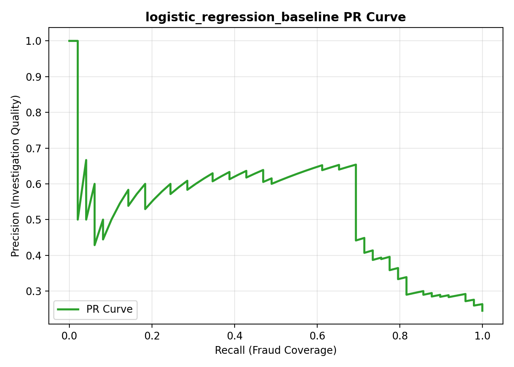

#### Random Forest Baseline *(Champion Model)*

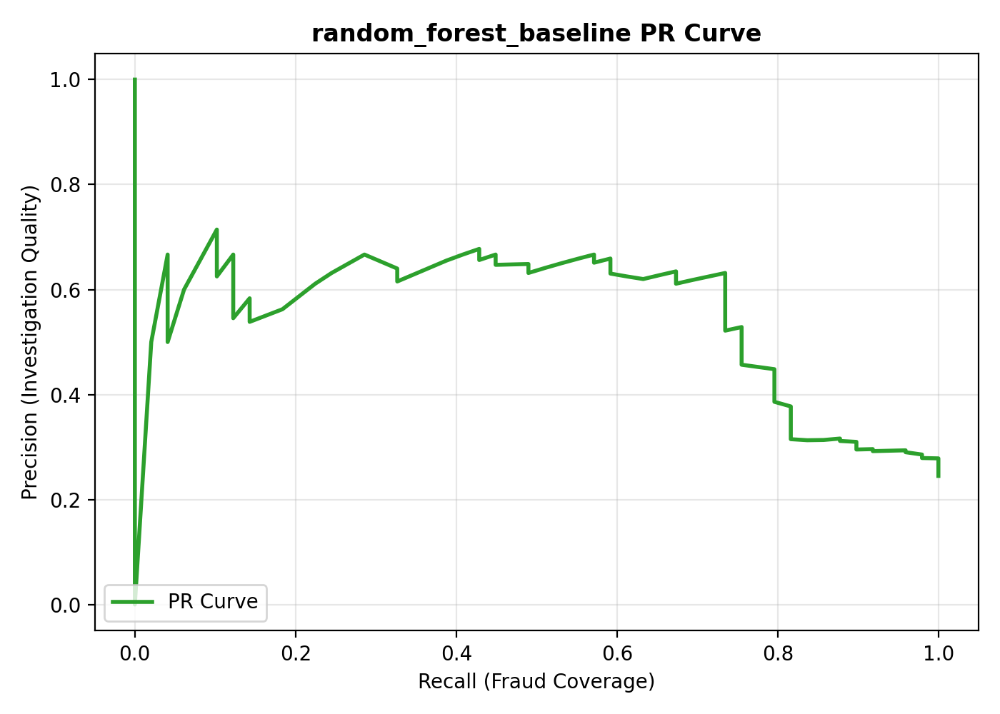

#### Random Forest Tuned

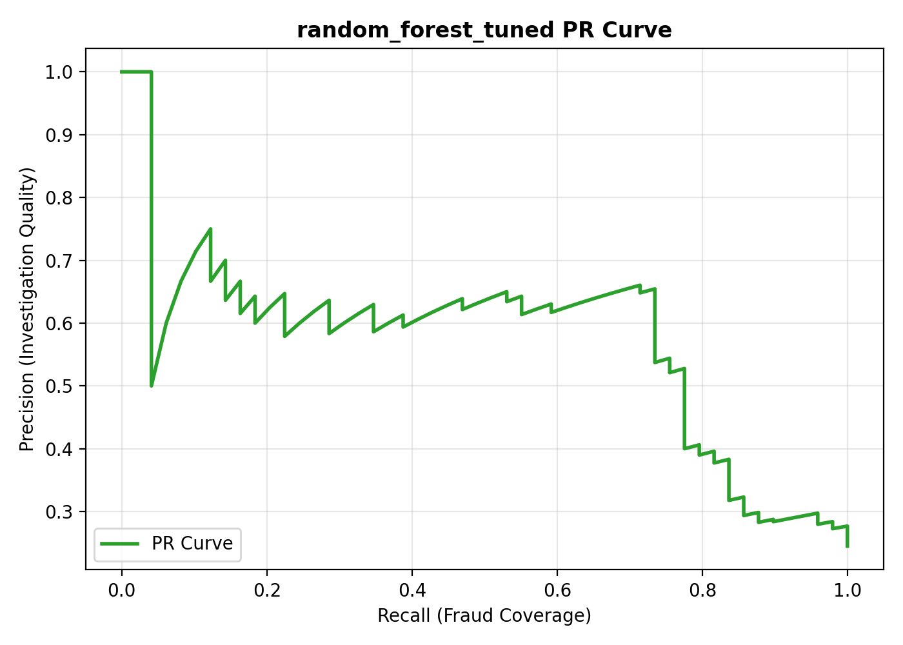

---

### 7.7 ROC Curves

| Logistic Regression | Random Forest Baseline | Random Forest Tuned |
|---|---|---|
| 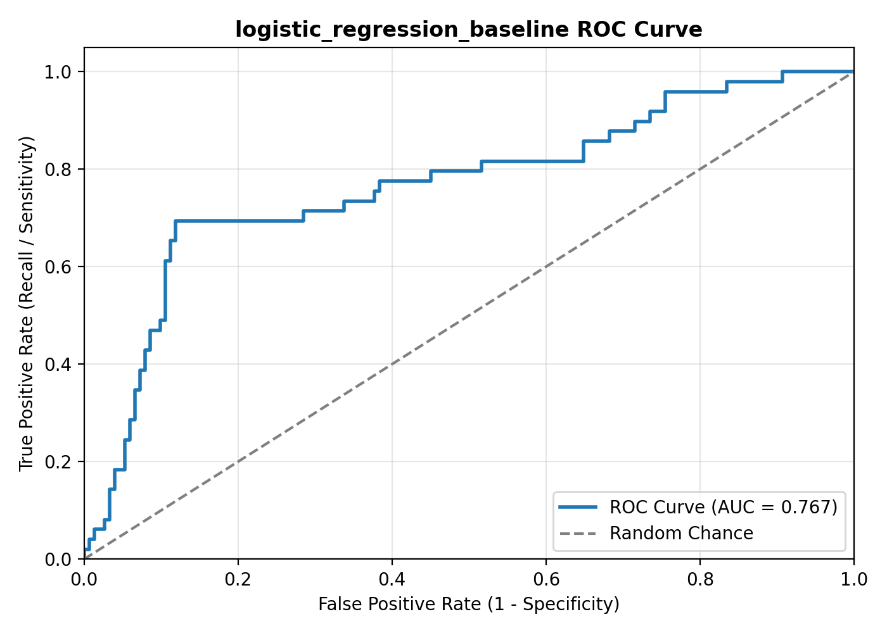 | 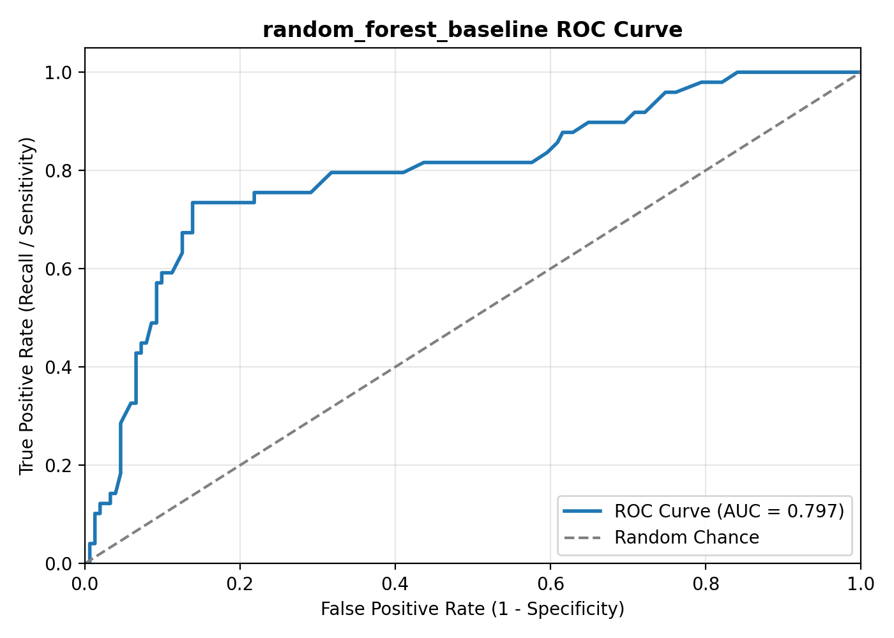 | 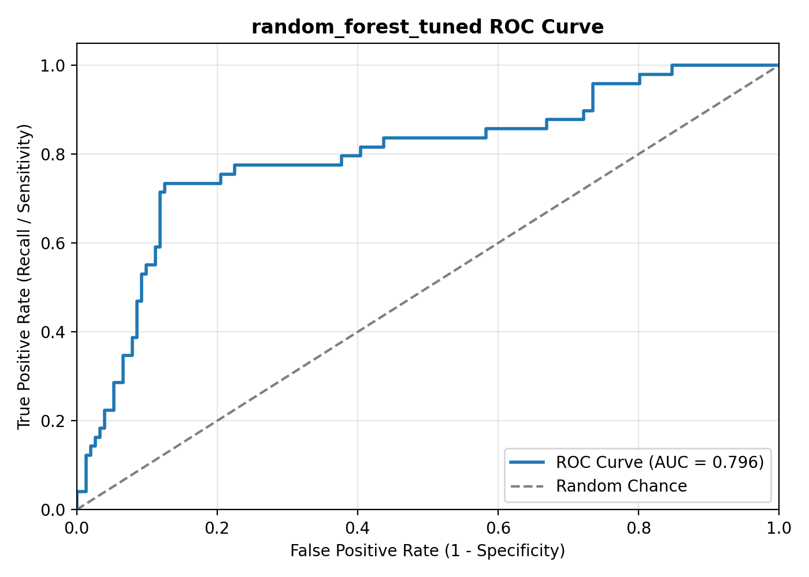 |

---

### 7.8 Threshold Trade-Off Curves

The threshold trade-off curves sweep across decision boundaries from 0.10 to 0.70 and plot Precision, Recall, and F1 simultaneously. These curves drove the **operating threshold selection** for each model.

| Logistic Regression (threshold=0.55) | Random Forest Baseline (threshold=0.35) | Random Forest Tuned (threshold=0.45) |
|---|---|---|
| 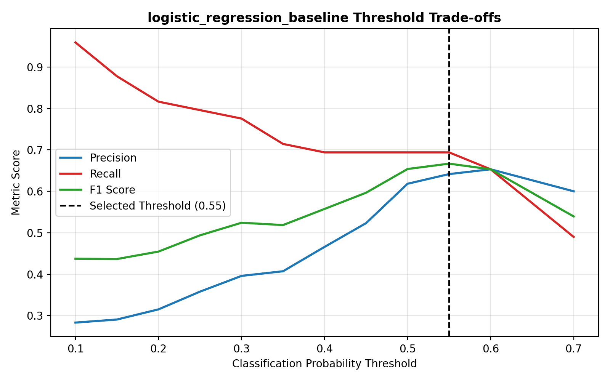 | 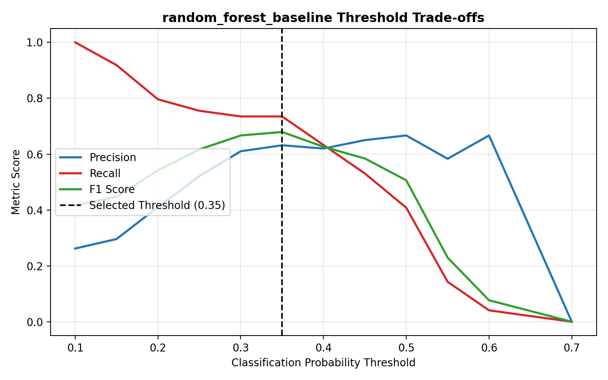 | 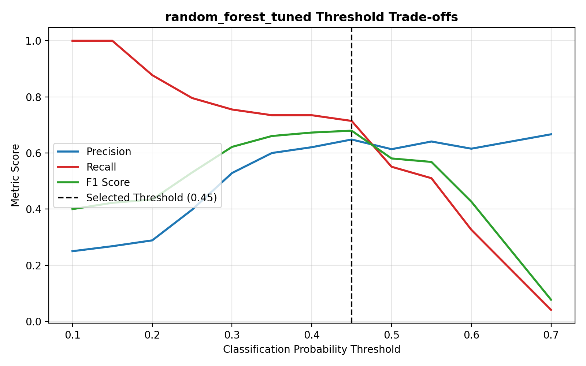 |

---

### 7.9 Confusion Matrices (at Operating Threshold)

| Logistic Regression (t=0.55) | Random Forest Baseline (t=0.35) | Random Forest Tuned (t=0.45) |
|---|---|---|
| 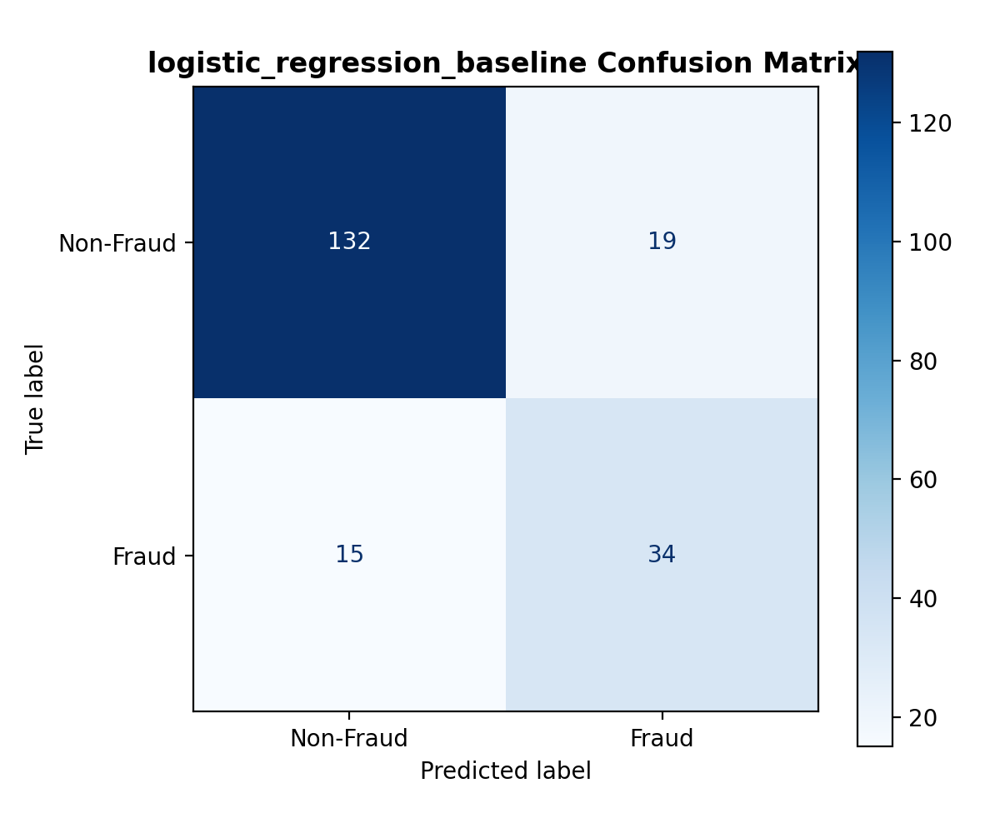 | 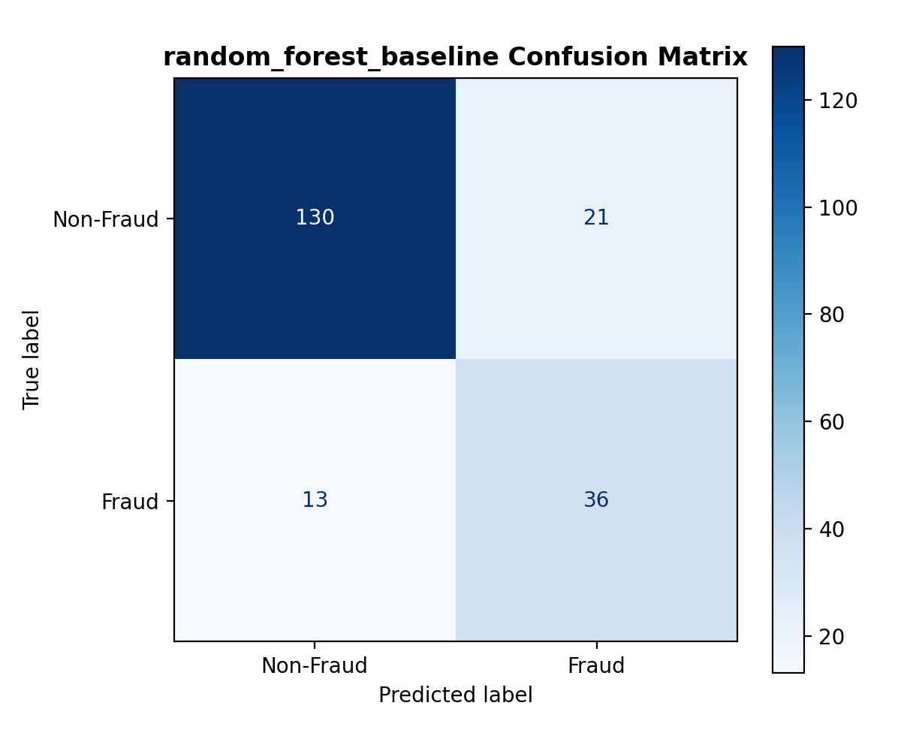 | 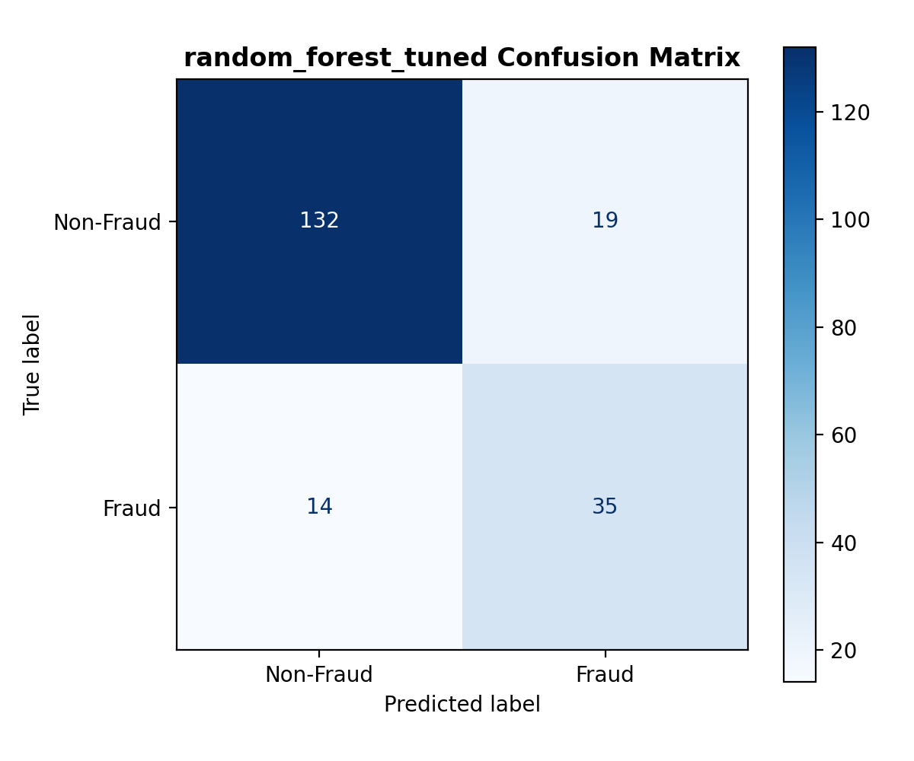 |

---

### 7.10 Feature Importance — Champion Model

The Gini-based feature importance for the champion `random_forest_baseline` model identifies the top predictors of fraud in the portfolio:

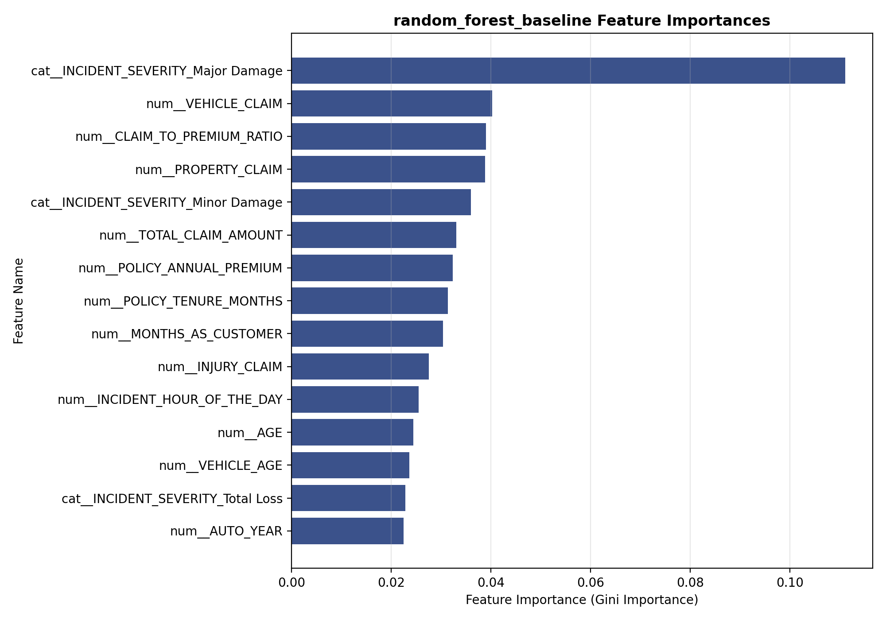

> **Top Signals**: `INCIDENT_SEVERITY_Major Damage` is the dominant predictor (importance ~0.12), followed by financial claim components (`VEHICLE_CLAIM`, `PROPERTY_CLAIM`, `CLAIM_TO_PREMIUM_RATIO`, `TOTAL_CLAIM_AMOUNT`). This aligns with the Snowflake analytics finding that Major Damage carries a **60.5% fraud rate**.

---

## 8. Setup & Execution Guide

### 1. Environment Setup
Clone the repository and install dependencies:
```bash
git clone https://github.com/aditya0589/insurance-claims-platform.git
cd insurance-claims-platform

python -m pip install -r requirements.txt
```

### 2. Configure Credentials (Optional for Live Snowflake)
Copy the environment template:
```bash
cp .env.example .env
cp .streamlit/secrets.toml.example .streamlit/secrets.toml
```
*Note: If Snowflake credentials are not supplied, the platform automatically utilizes the local analytical cache with full interactive functionality.*

### 3. Run Automated Tests
```bash
pytest tests/ -v
```

### 4. Train Models & Log to MLflow
```bash
python ml/train.py
```

### 5. Evaluate the Champion Model
```bash
python ml/evaluate.py
```

### 6. Launch the Streamlit Web Application
```bash
streamlit run streamlit/app.py
```
Open `http://localhost:8501` in your browser.

### 7. Launch MLflow Experiment UI
```bash
mlflow ui
```
Open `http://127.0.0.1:5000` to inspect experiment runs, threshold artifacts, and registered models.

---

## 9. Limitations & Future Roadmap

- **Dataset Size**: The current dataset contains 1,000 claims, serving as an architectural proof-of-concept. Validation metrics should be validated against larger multi-million claim portfolios.
- **Explainability (SHAP)**: Future iterations will integrate TreeSHAP waterfall plots into the Streamlit UI for individualized claim explanation.
- **Text Analytics**: Integrating NLP transformers (e.g. RoBERTa) on adjuster notes and police reports to extract unstructured fraud signals.
